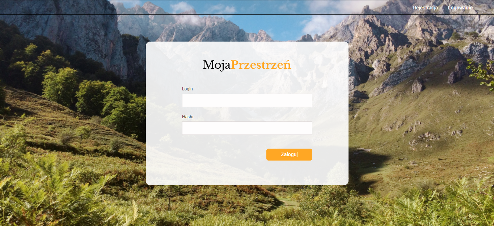
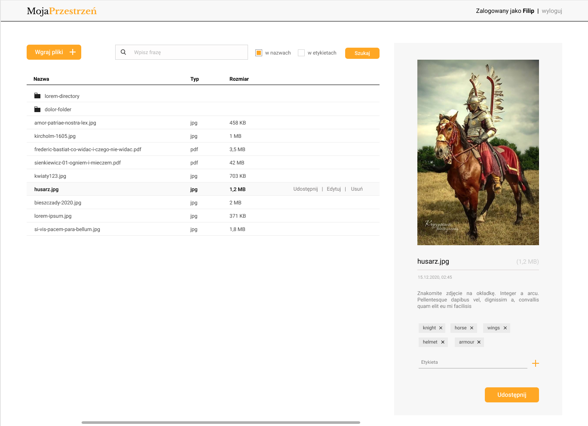
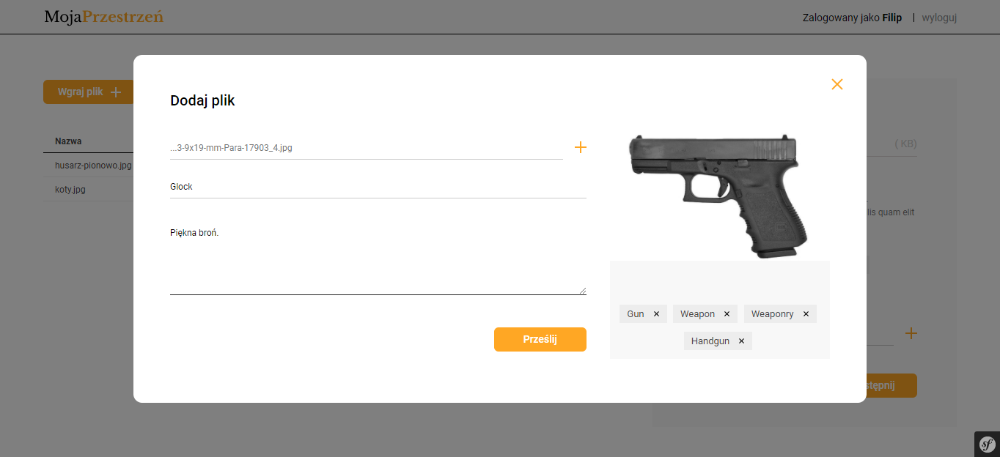
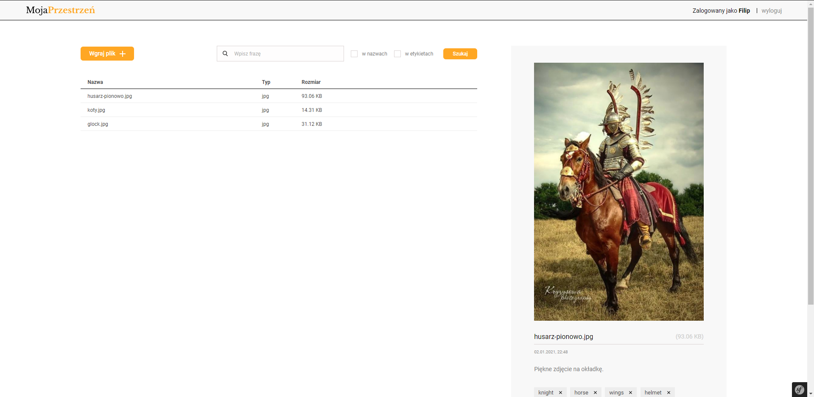
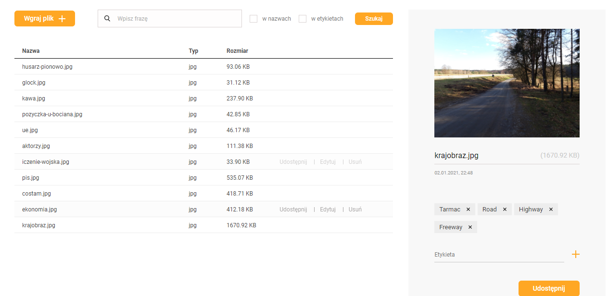
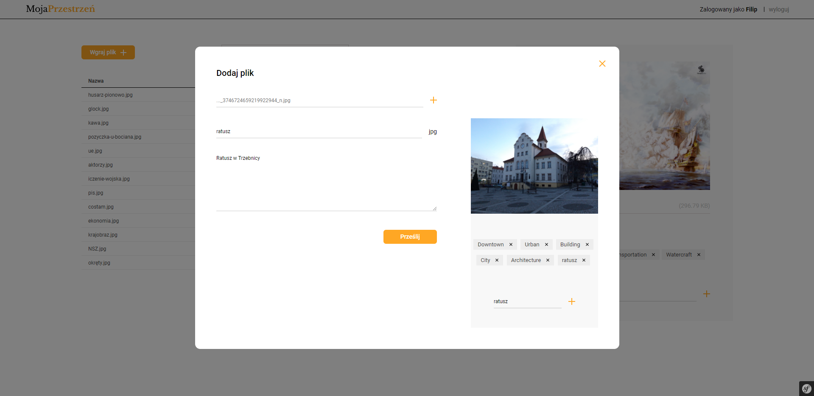
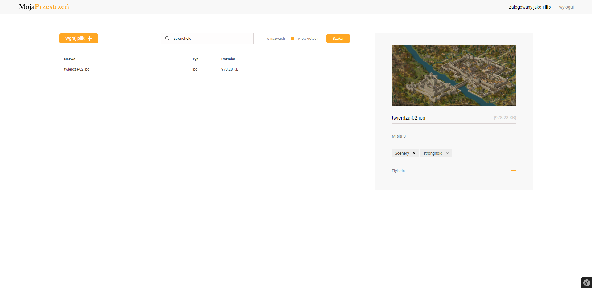

# MySpace App

## About project
A web application that enables file management within an organization. Supported options include searching for files by labels assigned automatically using AWS Rekognition and controlling access to stored resources.
Files are stored in the S3 service and application data is stored using Amazon RDS.

## Technologies

### Backend
- Java 15
- Spring
- Hibernate
- Amazon S3
- Amazon Rekognition

## Screens

